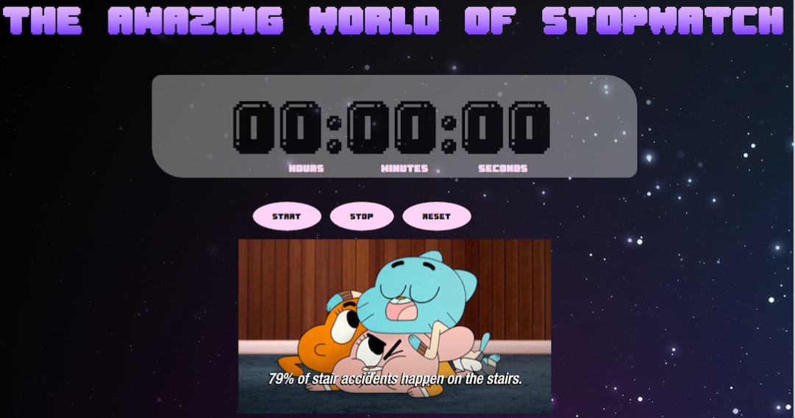

# The amazing world of Stopwatch

We develop a Stopwatch application from scratch, and only using Vanilla JavaScript.

- This is how our project looks:

## Functionality

* start
* stop
* reset

We use TDD to develop our project and testing framework Qunit.
